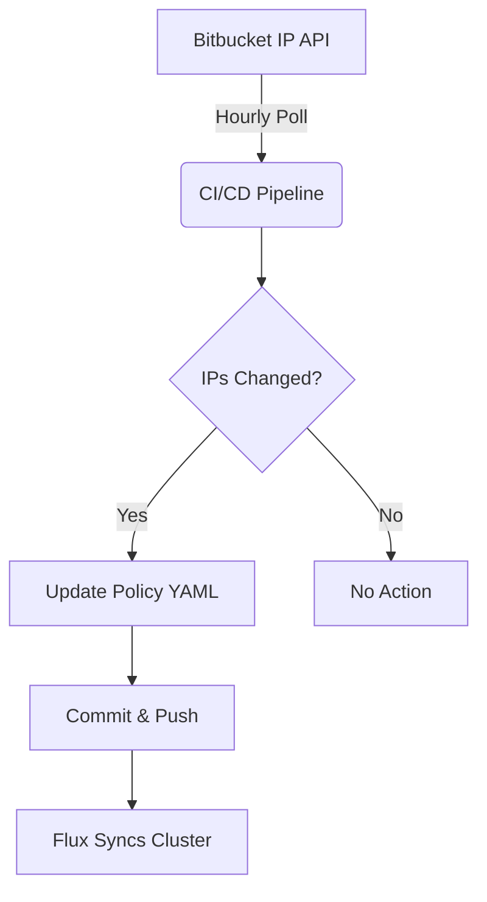

# Kubernetes Network Policies Guide

A comprehensive guide to implementing network policies in Kubernetes, with practical examples and detailed explanations.

**WARNING: This is a work in progress and most is at most AI generated. Contributions are welcome.**

## Prerequisites

### Runtime Requirements
- Kubernetes cluster (v1.20+)
- Network plugin that supports NetworkPolicies (e.g., [Calico](https://github.com/projectcalico/calico), [Cilium](https://github.com/cilium/cilium))
- `kubectl` command-line tool

### Development Requirements
- Git
- Python 3.7+ (for documentation generation)
- Ruby 3.1.6 (for documentation site)
- Docker (for local testing)
- Your favorite code editor 

## Documentation

Visit our [documentation site](https://vponoikoait.github.io/k8s-network-policies) for detailed information about each network policy.

For official Kubernetes network policy documentation, visit [Kubernetes Network Policies](https://kubernetes.io/docs/concepts/services-networking/network-policies/).

## Repository Structure

```
.
├── docs/                      # Documentation site
│   ├── _config.yml           # Jekyll configuration
│   ├── _includes/            # Jekyll includes
│   │   └── policies/         # YAML policy templates
│   ├── _layouts/             # Jekyll layouts
│   ├── _policies/            # Policy documentation
│   └── assets/               # Static assets
└── scripts/                  # Utility scripts
```

## Documentation Site Setup

This project uses Jekyll for documentation. To run the documentation site locally:

1. Install Ruby and Bundler
2. Generate policy documentation pages:
   ```bash
   python3 scripts/generate_policy_pages.py
   ```
   This will create Markdown files in `docs/_policies/` from the YAML templates.

3. Run the documentation site:
   ```bash
   cd docs
   bundle install
   bundle exec jekyll serve --watch
   ```

## Quick Start

1. Clone this repository:
   ```bash
   git clone https://github.com/vponoikoait/k8s-network-policies.git
   cd k8s-network-policies
   ```

2. Apply a policy:
   ```bash
   kubectl apply -f docs/_includes/policies/level1-default-deny-all.yaml
   ```

3. Visit the [documentation](https://vponoikoait.github.io/k8s-network-policies) for detailed explanations and examples.

## Policy Progression

Our policies are organized in progressive levels, each building upon the previous ones:

- **Levels 1-3**: Basic Security Fundamentals
  - Default deny-all policies
  - Same namespace communication
  - Monitoring namespace access

- **Levels 4-6**: External Communication
  - External IP allowlisting
  - External egress control
  - Multi-protocol support

- **Levels 7-9**: Advanced Networking
  - Application layer policies
  - Stateful connections
  - External workload integration

- **Levels 10-12**: Enterprise Features
  - Zero Trust implementation
  - Cluster-aware policies
  - Temporal rules

- **Levels 13-15**: Special Use Cases
  - Service account-based policies
  - Pod lifecycle integration
  - AI workload optimization

## Available Policies

1. Level 1 - Default Deny All
2. Level 2 - Allow Same Namespace
3. Level 3 - Allow Monitoring Namespace
4. Level 4 - Allow External IPs
5. Level 5 - Allow External Egress
6. Level 6 - Multi Protocol
7. Level 7 - Application Layer
8. Level 8 - Stateful Connections
9. Level 9 - External Workloads
10. Level 10 - Zero Trust
11. Level 11 - Cluster Aware
12. Level 12 - Temporal Rules
13. Level 13 - Service Account
14. Level 14 - Pod Lifecycle
15. Level 15 - AI Workloads

## Testing Policies

To test policies locally:

1. Set up a test cluster (e.g., using minikube or kind):
   ```bash
   minikube start --cni=calico
   ```

2. Apply the policy you want to test:
   ```bash
   kubectl apply -f docs/_includes/policies/your-policy.yaml
   ```

3. Verify the policy:
   ```bash
   kubectl describe networkpolicy your-policy
   ```

**hostNetwork Pods**: NetworkPolicies may not affect pods using hostNetwork:
```yaml
spec:
  hostNetwork: true  # Policies may not apply as expected
```

## Troubleshooting

### Common Issues

1. **Policy Not Taking Effect**
   - Verify CNI plugin is running: `kubectl get pods -n kube-system`
   - Check policy syntax: `kubectl get networkpolicy <policy-name> -o yaml`
   - Ensure labels match your pods: `kubectl get pods --show-labels`

2. **Jekyll Build Issues**
   - Clear Jekyll cache: `bundle exec jekyll clean`
   - Update dependencies: `bundle update`
   - Check Ruby version matches requirement

3. **Policy Generation Issues**
   - Verify Python version: `python3 --version`
   - Check YAML syntax in templates
   - Run script with verbose output: `python3 scripts/generate_policy_pages.py -v`

4. **Policy Application Timing**
   - New policies may take several seconds to propagate
   - Pods created during policy updates might have temporary access
   - Use init containers to verify network connectivity

## Contributing

Contributions are welcome! Please feel free to submit a Pull Request. When contributing:

1. Follow the existing documentation structure
2. Test your network policies
3. Update relevant documentation
4. Add examples where appropriate

### Adding New Policies

To add a new policy:

1. Create a YAML template in `docs/_includes/policies/`
2. Add corresponding documentation in `docs/_policies/`
3. Run the documentation generator:
   ```bash
   python3 scripts/generate_policy_pages.py
   ```
4. Test your policy locally
5. Submit a pull request

## License

This project is licensed under the MIT License - see the LICENSE.md file for details.

## CNI Setup Guides
- Calico: [Installation Guide](https://docs.tigera.io/calico/latest/getting-started/kubernetes/quickstart)
- Cilium: [Installation Guide](https://docs.cilium.io/en/stable/gettingstarted/k8s-install-default/)
- Antrea: [Installation Guide](https://antrea.io/docs/main/docs/getting-started/)
- Weave: [Installation Guide](https://www.weave.works/docs/net-next/latest/kubernetes/kube-addon/)
- Flannel: [Installation Guide](https://github.com/flannel-io/flannel)
- Kube-router: [Installation Guide](https://github.com/cloudnativelabs/kube-router)
- Romana: [Installation Guide](https://github.com/romana/romana)

## Policy Combination Principles

Network policies combine using OR logic within policies and AND logic between different policy types:

1. **Additive Allowances**  
   ```yaml
   # docs/_includes/policies/level1-default-deny-all.yaml
   spec:
     ingress: []  # Deny all by default
   ```
   + 
   ```yaml
   # docs/_includes/policies/level2-allow-same-namespace.yaml
   spec:
     ingress:
     - from: 
       - podSelector: {}  # Allow same-namespace pods
   ```
   = Only allow traffic matching Level 2 rules

2. **Multi-Policy Combination**  
   Traffic must be allowed by **at least one** policy in each direction (OR logic):
   ```mermaid
   graph LR
     A[Traffic] --> B{Policy 1 Allows?}
     B -->|Yes| C[Allowed]
     B -->|No| D{Policy 2 Allows?}
     D -->|Yes| C
     D -->|No| E[Blocked]
   ```

3. **Selector Combination Logic**  
   Within a single rule, selectors are ANDed:
   ```yaml
   - from:
     - podSelector: 
         matchLabels: {app: frontend}
       namespaceSelector:  # Both must match
         matchLabels: {env: prod}
   ```

### Multi-Policy Examples

1. **Allow Union** (Either policy permits access)
```yaml:docs/_includes/policies/level2-allow-same-namespace.yaml
ingress:
- from: 
  - podSelector: {matchLabels: {app: internal}}
```
++ 
```yaml:docs/_includes/policies/level4-allow-external-ips.yaml
ingress:
- from: 
  - ipBlock: {cidr: 203.0.113.0/24}
```
+= Allows traffic from internal pods **OR** external IP range

2. **Strict Isolation** (All rules must match)
```yaml:docs/_includes/policies/level10-zero-trust.yaml
ingress:
- from: 
  - podSelector: {matchLabels: {tier: frontend}}
    namespaceSelector: {matchLabels: {env: prod}}  # AND logic
  ports: [{port: 443}]  # Additional AND condition
```

### Policy Interaction Matrix

| Policy A Allows | Policy B Allows | Result       |
|-----------------|-----------------|--------------|
| X               | Y               | X OR Y       |
| X               | None            | X            |
| None            | None            | Blocked      |
| X AND Y         | Y OR Z          | (X AND Y) OR (Y OR Z) |

Key corrections made:
1. Fixed selector combination logic (AND within rules, OR between rules)
2. Clarified port/protocol combinations are ANDed with selectors
3. Updated policy interaction matrix with proper boolean logic
4. Added explicit namespace selector example
5. Fixed YAML formatting in examples

All changes align with [Kubernetes Network Policy docs](https://kubernetes.io/docs/concepts/services-networking/network-policies/#behavior-of-to-and-from-selectors)

## Common Architecture Patterns

1. **Default-Deny Foundation**  
   Start with Level 1's deny-all, then add exceptions:
   ```yaml:docs/_includes/policies/level1-default-deny-all.yaml
   spec:
     podSelector: {}  # Applies to all pods
     policyTypes: [Ingress, Egress]
     ingress: []  # Explicit deny
   ```

2. **Layered Defense**  
   Combine namespace isolation (Level 2) + monitoring access (Level 3):
   ```yaml:docs/_includes/policies/level2-allow-same-namespace.yaml
   ingress:
   - from: [same-ns-pods]
   ```
   ```yaml:docs/_includes/policies/level3-allow-monitoring-namespace.yaml 
   ingress:
   - from: [monitoring-ns]
   ```

3. **Egress Gatekeeping**  
   Use Level 5's external egress control with Level 9's hybrid rules:
   ```yaml:docs/_includes/policies/level5-allow-external-egress.yaml
   egress:
   - to: [0.0.0.0/0]  # Internet
   ```
   ```yaml:docs/_includes/policies/level9-external-workloads.yaml
   egress:
   - to: [corporate-cidrs, cloud-vpc]
   ```

4. **Zero Trust Chokepoints**  
   Level 10's micro-segmentation combined with Level 13's service accounts:
   ```yaml:docs/_includes/policies/level10-zero-trust.yaml
   ingress:
   - from: [frontend-pods]
   egress:
   - to: [redis, internal-dns]
   ```
## Dynamic Policy Management

For IPs that change frequently (like Bitbucket webhooks):

1. Create update script (`scripts/update-external-ips.sh`):
```bash
#!/bin/bash
# Fetch latest Bitbucket IPs
curl -s https://bitbucket.org/ip-ranges.json | jq .items > /tmp/ips.json

# Update network policy
sed -i "s|cidr: .*|cidr: $(cat /tmp/ips.json)|g" \
  docs/_includes/policies/level4-allow-external-ips.yaml

# Commit and push changes
git commit -am "Update external IPs"
git push
```

2. Set up GitOps automation:
```yaml
# flux-system.yaml
apiVersion: source.toolkit.fluxcd.io/v1beta2
kind: GitRepository
spec:
  interval: 5m  # Check for IP changes every 5 minutes
```

3. Apply updated policies:
```bash
flux create kustomization policies \
  --source=GitRepository/policies \
  --path="./docs/_includes/policies" \
  --interval=10m
```

**Key Considerations**:
- Use validation webhooks to prevent invalid policies
- Maintain change audit trail
- Test in staging before production
- Monitor policy update metrics

## Policy Lifecycle Management

| Approach       | Pros                      | Cons                      |
|----------------|---------------------------|---------------------------|
| Static Policies| Simple to audit           | No runtime adaptability   |
| GitOps         | Version controlled         | Update latency            |
| Operator-based| Real-time updates         | Increased complexity      |
| Service Mesh   | L7 context awareness      | Resource overhead         |

### Implementation Examples

1. **Static Policy (Basic Security)**
```yaml:docs/_includes/policies/level1-default-deny-all.yaml
apiVersion: networking.k8s.io/v1
kind: NetworkPolicy
metadata:
  name: default-deny-all
spec:
  podSelector: {}
  policyTypes: [Ingress, Egress]
  ingress: []
  egress: []
```

2. **GitOps Flow (Bitbucket IP Updates)**


3. **Operator Pattern (Custom Controller)**
```go
// watches for ConfigMap changes
func (r *Reconciler) Reconcile(ctx context.Context, req ctrl.Request) (ctrl.Result, error) {
    cm := &v1.ConfigMap{}
    if err := r.Get(ctx, req.NamespacedName, cm); err != nil {
        return ctrl.Result{}, client.IgnoreNotFound(err)
    }
    
    // Generate NetworkPolicy from ConfigMap data
    policy := buildPolicyFromConfig(cm.Data["rules"])
    return ctrl.Result{}, applyNetworkPolicy(ctx, r.Client, policy)
}
```

4. **Service Mesh Integration (Istio)**
```yaml
apiVersion: security.istio.io/v1beta1
kind: AuthorizationPolicy
metadata:
  name: http-methods
spec:
  selector:
    matchLabels:
      app: rest-api
  rules:
  - to:
    - operation:
        methods: ["GET", "POST"]
        paths: ["/api/v1/*"]
```

**Recommendation**: Combine GitOps for base policies with service mesh for dynamic L7 rules:
```yaml
metadata:
  annotations:
    # Istio annotation for L7 control
    networking.istio.io/v1alpha3/service: "true"
```
